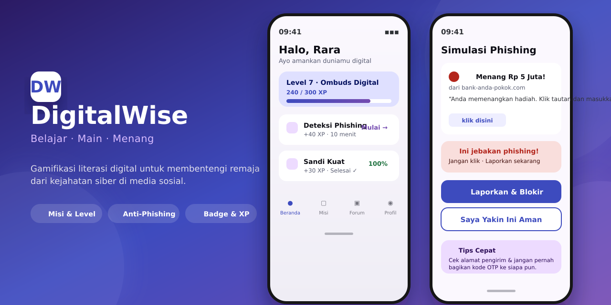

<p align="center">
  
</p>

<h1 align="center">🛡️ DigitalWise</h1>

<p align="center">
  <b>Gamifikasi literasi digital untuk membentengi remaja dari kejahatan siber.</b>
  <br/>
  Belajar · Main · Menang 🏆 — Poin, Badge, Level, XP, Peringkat, Lapor &amp; Bantuan.
</p>

<p align="center">
  
  
  
  
  
</p>

---

## ✨ Apa itu DigitalWise?

**DigitalWise** adalah aplikasi edukasi yang mengajak remaja belajar keamanan siber dengan cara yang **menyenangkan dan penuh gamifikasi**. Bukan sekadar materi — setiap misi, simulasi, dan kuis memberi **XP, badge, dan level** untuk menjaga semangat belajar.

**Fitur utama:**
- 🎯 **Misi & Level** — belajar bertahap dengan XP bar yang naik
- 🕵️ **Simulasi Anti-Phishing** — deteksi jejaring penipuan di situasi nyata
- 🔐 **Materi Keamanan Siber** — sandi kuat, privasi, jejak digital
- 🏅 **Badge & Peringkat** — motivasi lewat kompetisi sehat
- 🚩 **Lapor & Bantuan** — saluran aman melaporkan konten berbahaya
- 🌗 **Light & Dark mode** dengan tema Material You

---

## 🏗️ Arsitektur Monorepo

```
digitalwise/
├── 🎨 design/            # Desain Penpot — 22 board, prototype ter-wiring
├── mobile-app/           # 📱 Aplikasi Android (React Native / Expo)
│   ├── app/              #    Screens & navigasi
│   ├── components/       #    UI + gamification components
│   └── stores/           #    State management
├── admin-panel/          # 🖥️ Dashboard admin (React + Tailwind)
│   └── src/pages/        #    Kelola materi, misi, kuis, laporan
├── backend/              # ⚙️ Firebase Functions (Typescript)
│   ├── functions/src/    #    Forum, quiz, session, notification
│   └── seed/             #    Data awal materi/kuis
├── docs/                 # 📚 Handoff kit, rencana, screenshot
├── app.html              # 🖼️ Prototype HTML interaktif (light+dark)
└── tokens.css            # 🎨 Design tokens — single source of truth
```

---

## 🎨 Design System

Dibangun di atas **Material Design 3 (Material You)** dengan aksesibilitas **WCAG 2.2 AA**:

| Role | Light | Dark | Fungsi |
|------|-------|------|--------|
| **Primary** | `#3E4BBE` (indigo) | `#BDC3FF` | Aksi utama, identitas keamanan |
| **Tertiary** | `#744CB0` (violet) | `#D6BAFF` | Aksen gamifikasi: XP, badge, level |
| **Success** | `#1D6F3C` | `#8ED99B` | Misi selesai, aman |
| **Error** | `#B3261E` | `#F2B8B5` | Phishing, konten berbahaya |

> Semua pasangan warna tervalidasi kontras lewat `check-contrast.mjs` (48 pasangan AA).

---

## 🚀 Menjalankan Project

### 📱 Mobile app
```bash
cd mobile-app
npm install
npx expo start
```

### 🖥️ Admin panel
```bash
cd admin-panel
npm install
npm start          # development
npm run build      # production
```

### ⚙️ Backend (Firebase Functions)
```bash
cd backend/functions
npm install
npx tsc --watch
npm run deploy     # deploy ke Firebase
```

### 🧪 Verifikasi desain
```bash
node check-contrast.mjs   # cek 48 pasangan warna WCAG AA
node check-html.mjs       # cek keseimbangan tag HTML prototype
```

---

## 📊 Status Project

| Komponen | Status |
|----------|--------|
| Desain Penpot (22 board, light+dark) | ✅ Selesai |
| Prototype HTML interaktif | ✅ Selesai |
| Design tokens + verifikasi kontras | ✅ Selesai |
| Mobile app (Expo) | 🚧 Dalam pengembangan |
| Admin panel | 🚧 Dalam pengembangan |
| Firebase Functions | 🚧 Dalam pengembangan |

---

## 🛡️ Keamanan

- **RLS** pada data konten berbasis `auth.uid` / role (bukan `auth.role` yang bisa dipalsukan)
- Progress per-user dihitung dari data aktual, bukan jumlah katalog
- Protokol **lapor & blokir** untuk konten berbahaya
- Tidak ada secret yang di-commit ke repository (`.env` & service account di-ignore)

---

## 👥 Kontributor

Built by **Mohammad Fahri Saleh** — desain, prototype, dan engineering.

---

<p align="center">
  <sub>Dibuat dengan 💜 · Material Design 3 · WCAG AA · Education for a safer digital world</sub>
</p>
