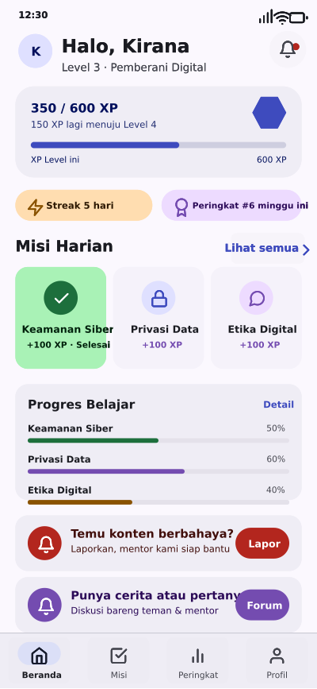
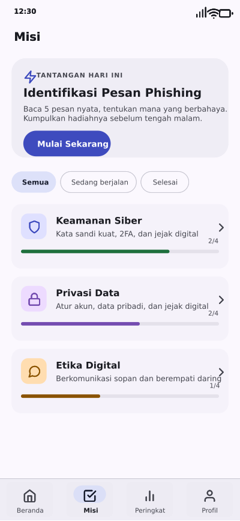
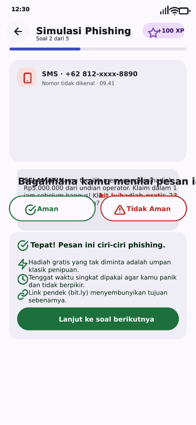
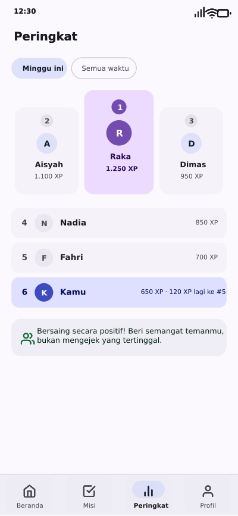
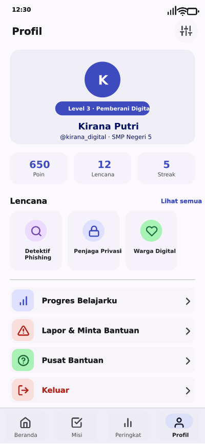
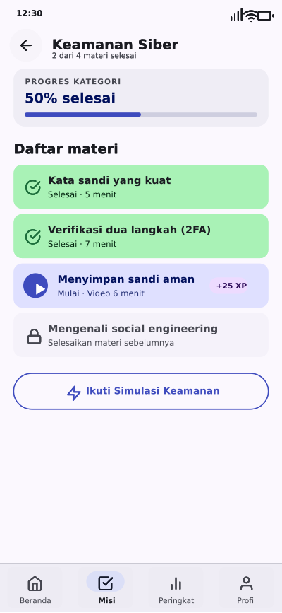
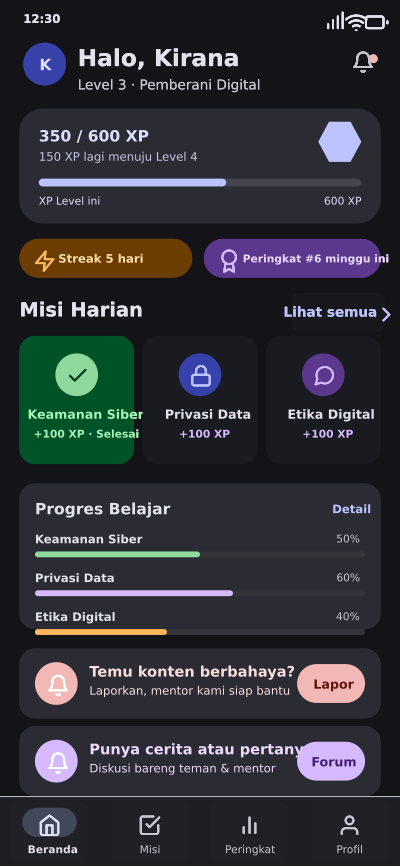

<p align="center">
  
</p>

<h1 align="center">🛡️ DigitalWise</h1>

<p align="center">
  <b>Gamifikasi literasi digital untuk membentengi remaja dari kejahatan siber di media sosial.</b><br/>
  <code>Belajar · Main · Menang 🏆</code> — Poin, Badge, Level, XP, Peringkat, Lapor &amp; Bantuan.
</p>

<p align="center">
  
  
  
  
  
  
  
</p>

---

## ✨ Mengapa DigitalWise?

Remaja menghabiskan waktu berjam-jam di media sosial — tapi jarang dibekali **keterampilan mengenali bahaya** di sana: phishing, penipuan, konten berbahaya, dan eksploitasi. **DigitalWise** mengubah materi keamanan siber yang membosankan menjadi **petualangan belajar yang seru**, dengan mekanika gamifikasi yang menjaga motivasi tetap hidup.

**Fitur utama:**

- 🎯 **Misi & Level** — belajar bertahap dengan XP bar yang terus naik
- 🕵️ **Simulasi Anti-Phishing** — latihan mengenali penipuan dalam skenario realistis
- 🔐 **Materi Keamanan Siber** — sandi kuat, privasi, jejak digital, & proteksi akun
- 🏅 **Badge & Peringkat** — papan peringkat untuk kompetisi sehat antar teman
- 🚩 **Lapor & Bantuan** — saluran aman melaporkan konten serta meminta pertolongan
- 🌗 **Light & Dark Mode** — tema Material You adaptif dengan kontras WCAG AA

---

## 📱 Screenshots (Dari Desain Penpot Asli)

> Semua layar di bawah adalah ekspor langsung dari file desain **Penpot** (bukan mockup).

<div align="center">
  
  
  
  
  
  
</div>

<p align="center"><em>Light mode</em> — tampilkan <b>dark mode</b> juga:</p>
<div align="center">
  
</div>

---

## 🏗️ Arsitektur Monorepo

```
digitalwise/
├── 🎨 design            # Desain Penpot — 22 board, prototype ter-wiring (74 interaksi)
├── 📱 mobile-app/       # Aplikasi Android (React Native / Expo)
│   ├── app/             #    Screens & navigasi (tabs, onboarding, quiz, forum…)
│   ├── components/      #    UI + komponen gamification
│   ├── stores/          #    State management
│   └── hooks/ lib/      #    Logic & utilitas
├── 🖥️ admin-panel/      # Dashboard admin (React + Tailwind + React Query)
│   └── src/pages/       #    Kelola materi, misi, kuis, laporan, pengaturan
├── ⚙️ backend/          # Firebase Functions (TypeScript)
│   ├── functions/src/   #    forum, quiz, session, notification
│   └── seed/            #    Data awal materi & kuis
├── 📚 docs/             # Handoff kit, rencana, screenshot
├── 🖼️ app.html          # Prototype HTML interaktif (light + dark)
└── 🎨 tokens.css        # Design tokens — single source of truth (M3)
```

---

## 🎨 Design System

Dibangun di atas **Material Design 3 (Material You)** dengan aksesibilitas **WCAG 2.2 AA** (48 pasangan warna tervalidasi lewat `check-contrast.mjs`).

| Role | Light | Dark | Fungsi |
|------|-------|------|--------|
| **Primary** | `#3E4BBE` · indigo | `#BDC3FF` | Aksi utama, identitas keamanan |
| **Tertiary** | `#744CB0` · violet | `#D6BAFF` | Aksen gamifikasi: XP, badge, level |
| **Success** | `#1D6F3C` | `#8ED99B` | Misi selesai, status aman |
| **Error** | `#B3261E` | `#F2B8B5` | Phishing, konten berbahaya |

> Design tokens sumber kebenaran di `tokens.css`, konsisten antara prototype HTML, mobile app, dan admin panel.

---

## 🚀 Menjalankan Project

### 📱 Mobile App (Expo)
```bash
cd mobile-app
npm install
npx expo start
```

### 🖥️ Admin Panel
```bash
cd admin-panel
npm install
npm start          # development
npm run build      # production
```

### ⚙️ Backend (Firebase Functions)
```bash
cd backend/functions
npm install
npx tsc --watch
npm run deploy     # deploy ke Firebase
```

### 🧪 Verifikasi Desain
```bash
node check-contrast.mjs   # cek 48 pasangan warna (WCAG AA)
node check-html.mjs       # cek keseimbangan tag HTML prototype
```

---

## 🗺️ Roadmap

| Fitur | Status |
|-------|--------|
| Desain Penpot (22 board, light + dark, prototype ter-wiring) | ✅ Selesai |
| Prototype HTML interaktif | ✅ Selesai |
| Design tokens + verifikasi kontras WCAG AA | ✅ Selesai |
| Onboarding & izin pengguna | 🚧 Pengembangan |
| Misi, level, XP & badge | 🚧 Pengembangan |
| Simulasi anti-phishing | 🚧 Pengembangan |
| Forum diskusi | 🚧 Pengembangan |
| Admin panel (materi, laporan, setting) | 🚧 Pengembangan |
| Backend & integrasi Firebase | 🚧 Pengembangan |

---

## 🛡️ Keamanan

- **RLS** pada akses konten berbasis `auth.uid` / role (bukan `auth.role` yang bisa dipalsukan)
- Progress per-user dihitung dari data aktual, bukan jumlah katalog
- Protokol **lapor & blokir** untuk konten berbahaya
- Tidak ada secret yang di-commit (`*.env` & service account di-ignore)

---

## 👥 Kontributor

Built with 💜 by **Mohammad Fahri Saleh** — desain, prototype, dan engineering.

---

<p align="center">
  <sub>Material Design 3 · WCAG AA · Dibuat untuk generasi digital yang lebih aman</sub>
</p>
